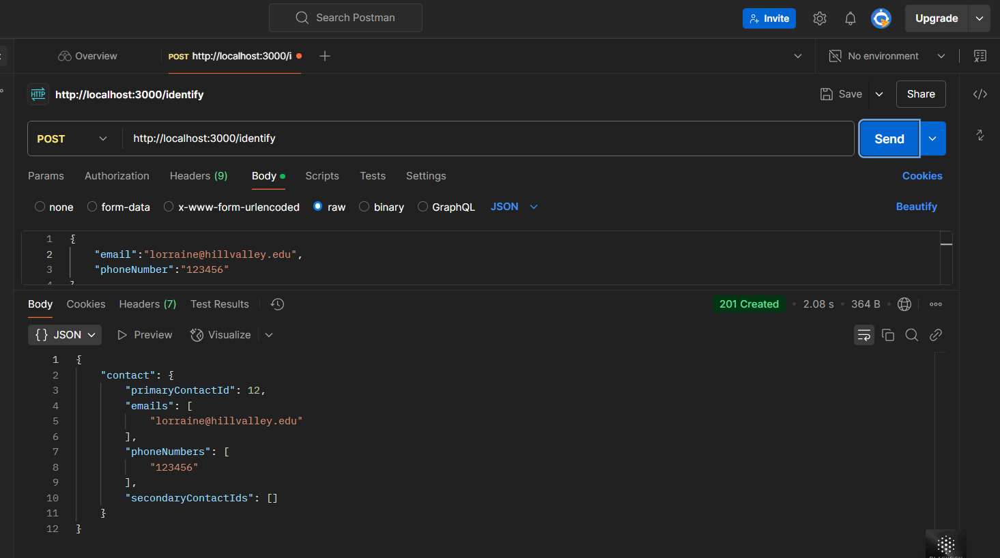
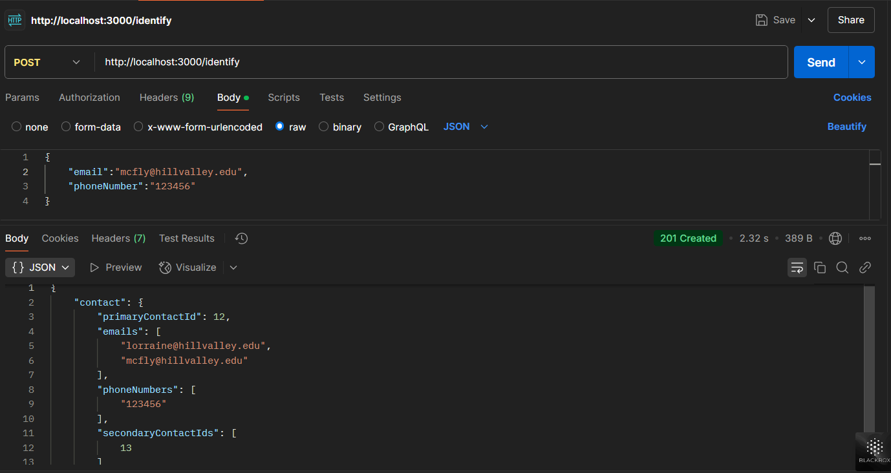
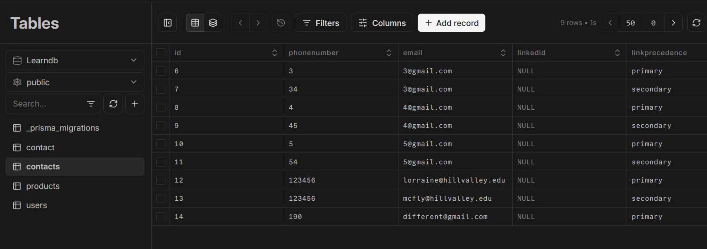

# BiteSpeed Backend Assignment

I have successfully completed the BiteSpeed backend assignment using a relational database, PostgreSQL. For the backend HTTP routes, I used Express and Node.js in JavaScript. Additionally, I deployed my code on Render.com. You can find the deployed application at the following URL: [Your URL Here].

## Features

- **Database**: PostgreSQL
- **Backend Framework**: Express and Node.js
- **Deployment**: Render.com

## Task Description

I created the `/identify` POST request which takes a raw JSON body containing `email` and `password`. Based on the query results from the `contacts` table, the database is manipulated by either changing the primary to secondary or adding a new entry if it does not exist.

## Example Request

```json
POST /identify
Content-Type: application/json

{
    "email": "example@example.com",
    "phoneNumber": "yourPhoneNumber"
}
```

## Example Response

```json
contact: {
                            "primaryContactId": "resultRows[0].id",
                            "emails": ["newContact.email"],
                            "phoneNumbers": ["currResultPhoneNumber", "newContact.phonenumber"],
                            "secondaryContactIds": ["newContact.id"]
} 

```

## Screenshots

### New Data Insertion 


### Handling with existing



### Database Entries


### API Response


Thank you.